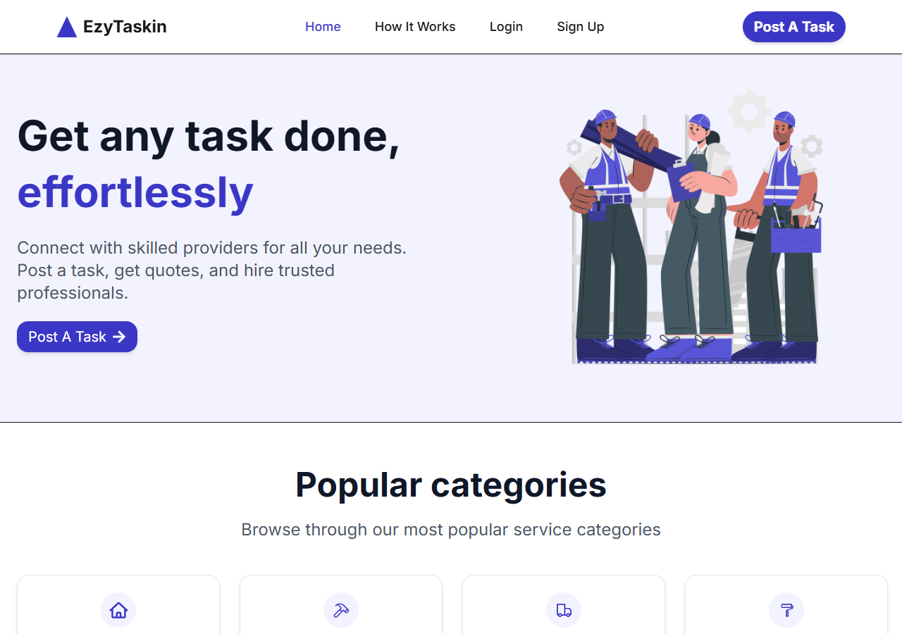
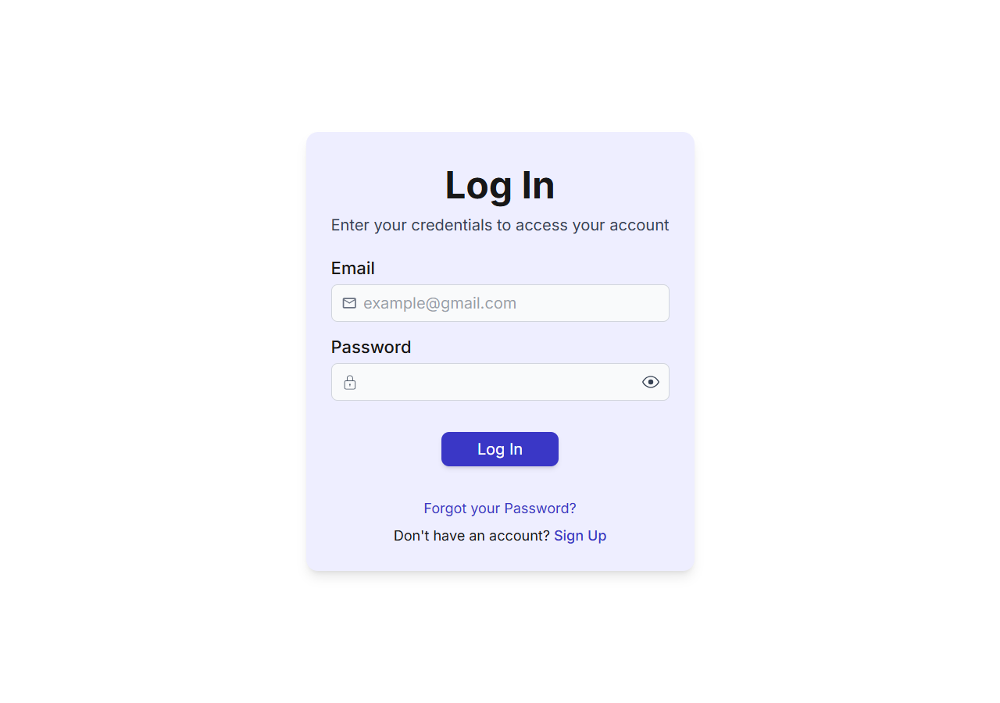
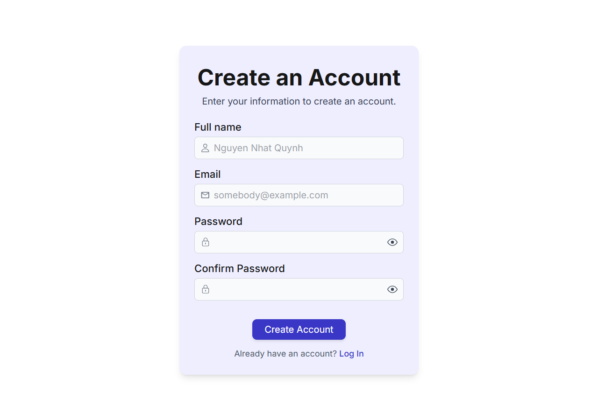
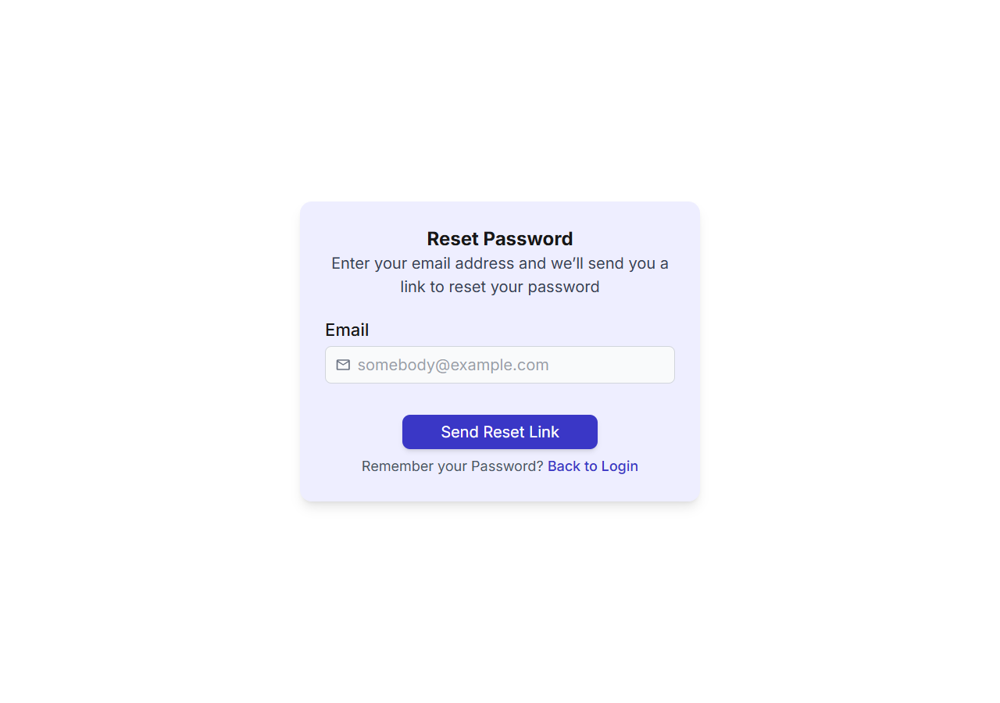

# InTalentMatch

A talent matching platform that connects employers with candidates. Built on Next.js, Prisma, and Postgres.

## Stack

- Next.js 15 (App Router, Turbopack)
- React 19
- Prisma 6 + Postgres
- Auth.js v5 (Credentials + OAuth where wired)
- Zod for validation
- Tailwind 4 with a custom design token layer
- Postmark for transactional email
- Vitest for unit tests, Playwright for E2E
- Sentry for runtime monitoring

## Getting started

Need Node 20+ and a local Postgres (or any reachable instance).

```
git clone https://github.com/notabota/InTalentMatch.git
cd InTalentMatch
cp .env.example .env  # fill in DATABASE_URL, AUTH_SECRET, etc
npm i
npx prisma generate
npx prisma migrate dev
npm run seed
npm run dev
```

Open <http://localhost:3000>.

Seed creates three accounts. All share password `password123`:

- alice@example.com
- bob@example.com
- carol@example.com

## Scripts

```
npm run dev          # next dev with turbopack
npm run build        # prisma generate + next build
npm run start        # next start
npm test             # vitest
npm run test:e2e     # playwright
npm run seed         # reset + reseed dev database
```

## Project layout

```
prisma/                  schema, migrations, seed
src/
  app/
    (landing)/           public landing
    (main)/              authenticated app
    Account/             auth pages (login, register, forgot, reset)
    api/                 route handlers (REST)
    constants/           shared types and lists
    helpers/api/         client-side fetch helpers
    hooks/               React Query style hooks over the helpers
  components/
    ui/                  primitive design system
    layout/              shared shell (header, footer)
    domain/              reusable domain pieces (JobCard, JobDetailHeader)
  lib/                   server-side services, prisma client, auth helpers
scripts/                 ops scripts, screenshot capture, smoke tests
tests/                   unit, e2e, perf
docs/                    screenshots and reference material
.github/                 templates, CODEOWNERS, CI workflow
```

## Team

| Role | Member |
|---|---|
| Lead and integration | [@notabota](https://github.com/notabota) |
| Design system and landing | [@hoangngocanhpham](https://github.com/hoangngocanhpham) |
| Browse and jobs | [@hoaiphuong26](https://github.com/hoaiphuong26) |
| Auth, post, profile | [@qhuongneh](https://github.com/qhuongneh) |
| Postings, chat, plan | [@VietVo0807](https://github.com/VietVo0807) |

See [CODEOWNERS](.github/CODEOWNERS) for the full review routing.

## Conventions

Trunk-based development with short-lived branches and squash-merges. See [CONTRIBUTING.md](CONTRIBUTING.md) for the details.

## Screenshots

| Landing | Login |
|---|---|
|  |  |

| Register | Forgot password |
|---|---|
|  |  |

| Home |
|---|
|  |
